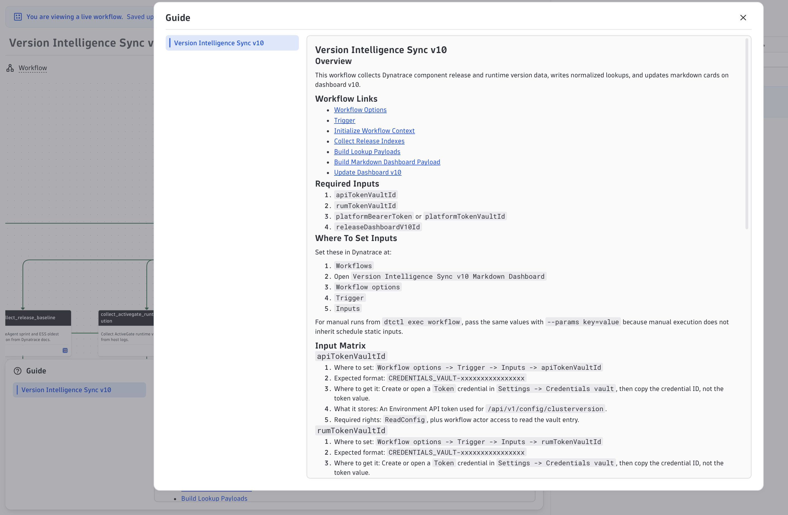

# Quick Start — Operator Install Guide

This guide gets you from zero to a working release-tracking dashboard in about 10 minutes.


---

## Before you begin

You need four values from your Dynatrace tenant. Gather these first.

| Input | What it is | Where to get it |
|---|---|---|
| `apiTokenVaultId` | Credential Vault ID for an API token with `ReadConfig` | Settings → Credential Vault → copy the **credential ID** (not the token value) |
| `rumTokenVaultId` | Credential Vault ID for an API token with `ReadConfig`, `ReadSyntheticData`, `events.ingest` | Same as above |
| `platformTokenVaultId` | Credential Vault ID for a platform/JWT token that can read and write dashboard documents | Same as above |
| `releaseDashboardV12Id` | The UUID of the dashboard after you import it (step 3 below) | Copy from the dashboard URL after import |

> **Format**: Credential Vault IDs look like `CREDENTIALS_VAULT-xxxxxxxxxxxxxxxx`. Use the ID, not the token value itself.

---

## Install

### Step 1 — Import the dashboard

1. In Dynatrace, go to **Dashboards**
2. Click **Upload** and select `dashboards/release-tracking-dashboard.v12.json`
3. Open the uploaded dashboard and copy its UUID from the URL:
   ```
   /ui/apps/dynatrace.dashboards/dashboard/<THIS-IS-YOUR-UUID>
   ```
   Save this — you'll need it in Step 3.

### Step 2 — Import the workflow

1. Go to **Workflows**
2. Click **Upload** and select `workflows/version-intelligence-sync.v12.workflow.json`

### Step 3 — Set workflow inputs

1. Open the imported workflow
2. Click **Workflow options** → **Trigger** → **Inputs**
3. Set all four values:

   | Input | Value |
   |---|---|
   | `apiTokenVaultId` | Your Credential Vault ID (ReadConfig token) |
   | `rumTokenVaultId` | Your Credential Vault ID (RUM token) |
   | `platformTokenVaultId` | Your Credential Vault ID (platform JWT token) |
   | `releaseDashboardV12Id` | Dashboard UUID from Step 1 |

4. Save

### Step 4 — Add the workflow guide

The workflow guide (visible in Dynatrace's Workflow Guide panel) cannot be imported automatically. Paste it in manually:

1. In the workflow, click **Workflow options** → **Guide**
2. Copy the contents of [docs/WORKFLOW_GUIDE_V12.md](docs/WORKFLOW_GUIDE_V12.md)
3. Paste into the Guide editor and save



### Step 5 — Run and verify

1. Click **Run** (manual trigger) to execute the workflow once
2. Wait for all tasks to complete (green checkmarks)
3. Open the dashboard — all component cards should populate with release data
4. Enable the workflow schedule when ready

---

## Troubleshooting

| Symptom | Fix |
|---|---|
| Dashboard update fails with 401 JWT parse error | Set a valid platform JWT token in `platformTokenVaultId` |
| Dashboard cards show no data after run | Verify `releaseDashboardV12Id` matches your dashboard UUID |
| `Token Authentication failed` on rum or oneagent tasks | Rotate the token stored inside the Credential Vault entry referenced by `rumTokenVaultId` |
| HTTP 403 from RUM or events APIs | The token is valid but missing required scopes — add `ReadSyntheticData` and `events.ingest` |

---

## Next steps

- **Want to automate deployments?** See [docs/DEPLOYING.md](docs/DEPLOYING.md) — deploy updates with a single `make deploy` command without touching the Dynatrace UI.
- **Want to extend or version-bump the workflow?** See [CONTRIBUTING.md](CONTRIBUTING.md).
