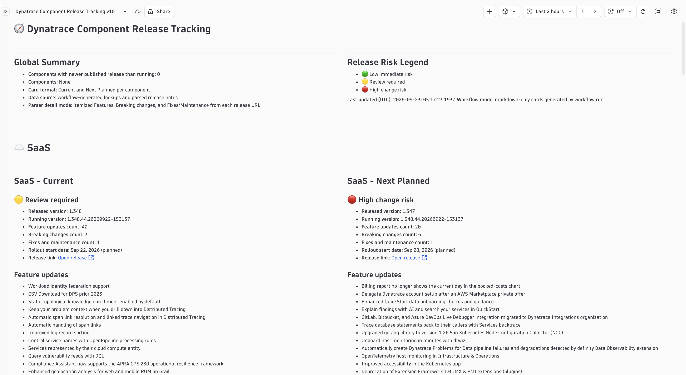

# Dynatrace Version Release Tracking

A workflow + dashboard package that automatically tracks Dynatrace component release versions, compares them against what's running in your environment, and surfaces a visual risk summary — so you always know what's changed and whether you need to act.



---

## What it does

- Collects published release metadata for SaaS, OneAgent, ActiveGate, Operator, and EdgeConnect
- Compares released versions against runtime versions in your tenant
- Writes normalized lookup tables for DQL queries
- Updates a markdown-card dashboard with per-component risk ratings: green (low risk), yellow (review), red (high change)
- Runs on a schedule — no manual effort after setup

---

## Who this is for

| You want to... | Start here |
|---|---|
| **Install and run it** | [QUICK_START.md](QUICK_START.md) |
| **Modify or extend it** | [CONTRIBUTING.md](CONTRIBUTING.md) |
| **Deploy to your own tenant with a single command** | [docs/DEPLOYING.md](docs/DEPLOYING.md) |

---

## Install assets

Two files are all you need for first-time setup:

| File | Purpose |
|---|---|
| `workflows/version-intelligence-sync.v12.workflow.json` | The automation workflow |
| `dashboards/release-tracking-dashboard.v12.json` | The dashboard |

Older `v1`–`v11` files stay in the repo for rollback traceability only — you do not need them for installation.

---

## Repository layout

```
workflows/          canonical v12 workflow + historical versions
dashboards/         canonical v12 dashboard + historical versions
docs/               operator and developer guides, runbooks, architecture notes
  images/           screenshots
scripts/            validation and deploy helpers
references/         historical workflow snapshots for traceability
```

---

## Versioning rule

Workflow `vN` must only update dashboard `vN`. Every behavior change creates a new `vN+1` pair — never edit previous versions in place. See [docs/VERSION_ALIGNMENT_POLICY.md](docs/VERSION_ALIGNMENT_POLICY.md).
